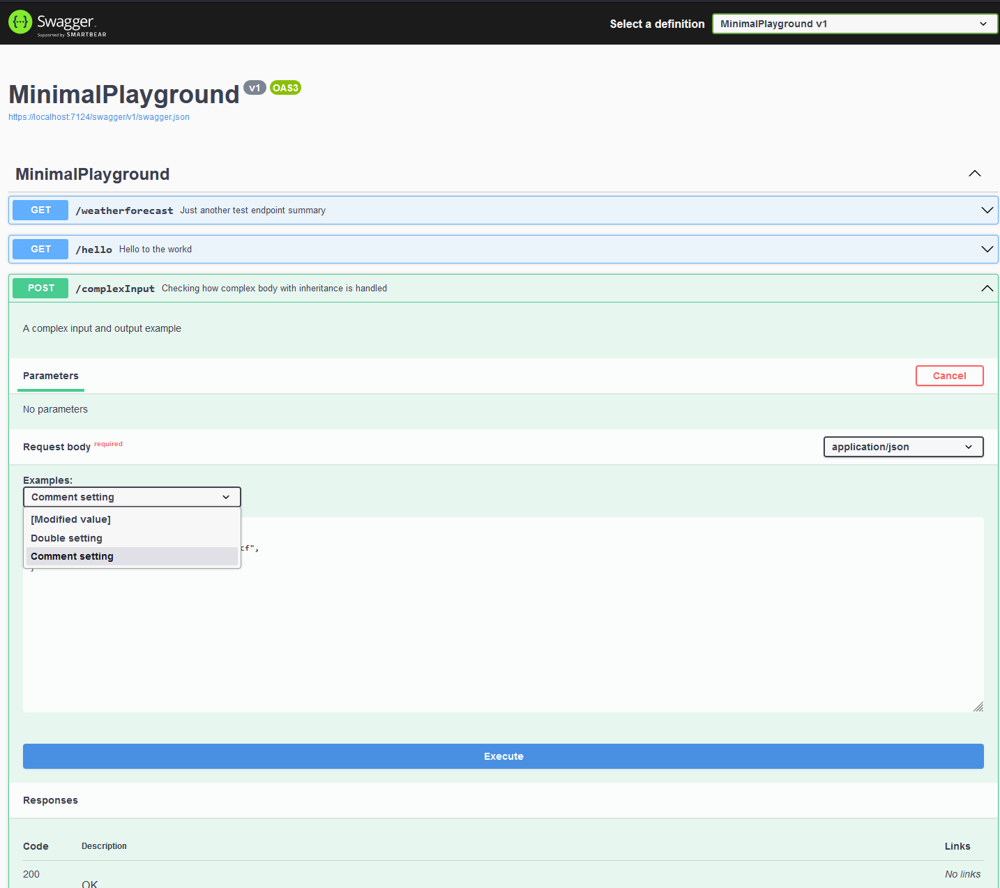

# Minimal api playground

My playground experimenting minimal api and all stuffs around it like swagger client generation, example definition, and polymorphism on body and response.

## Client generation

- Use dotnet tools to generate the openapi.json file
- generate c# client with another dotnet tool

See `generate-rest-client.ps1` script file content

## Expose derived body class schema on swagger page

In AddSwaggerGen() option delegate use

```cs
builder.Services.AddSwaggerGen(options =>
{
    ...
    options.UseAllOfForInheritance();
    options.UseOneOfForPolymorphism();
});
```

## Add specific example in swagger documentation

1. In AddSwaggerGen() option delegate use

```cs
builder.Services.AddSwaggerGen(options =>
{
    ...
    options.ExampleFilters();
});
```

2. Then, call the following method so assemblies are scan in search of example provider per body / response types.

```cs
builder.Services.AddSwaggerExamplesFromAssemblies(Assembly.GetEntryAssembly());
```

3. Implement `IMultipleExamplesProvider<T>` or `IExamplesProvider<T>` classes providing your examples for the swagger api endpoints per body/reponse classes

